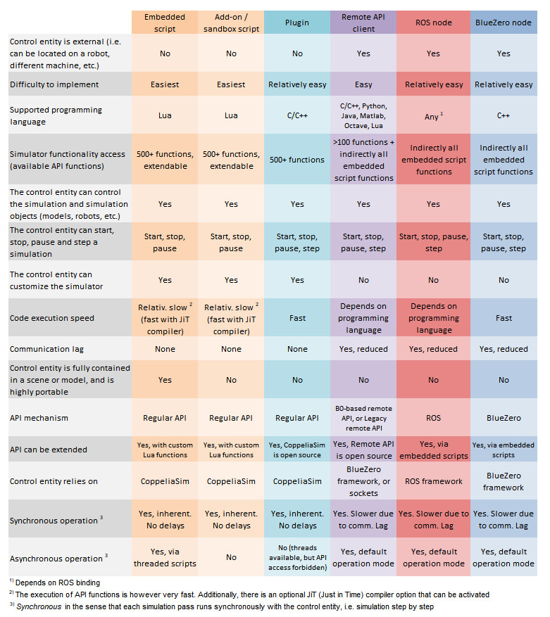
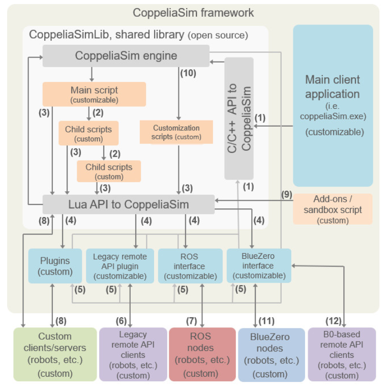

# vrep 仿真学习

vrep 的仿真环境叫做 CoppeliaSim, 而使用操作仿真环境的手段有很多，有大概六种方式：  
  
  
  
而更加细节的原理是这样的：
  
  
  
## python remote control

好吧，我承认，我懒得去理解了，只是看了个大概，我主要的目的就是通过 python 控制 vrep 其他的就还是算了。  
  
python 控制 vrep 主要通过 remote api, 而 remote api 似乎莫名其妙地分为了两种：
* B0-based remote api -- BlueZero 中间层之上的 legacy remote api 封装，可以说是第二版的 remote api，比 legacy 更直观。
* legacy remote api -- 老版 remote api 稍微复杂一点，老版 remote api 也就是第一版 remote api，相比起 B0 来说需要安装的依赖少。